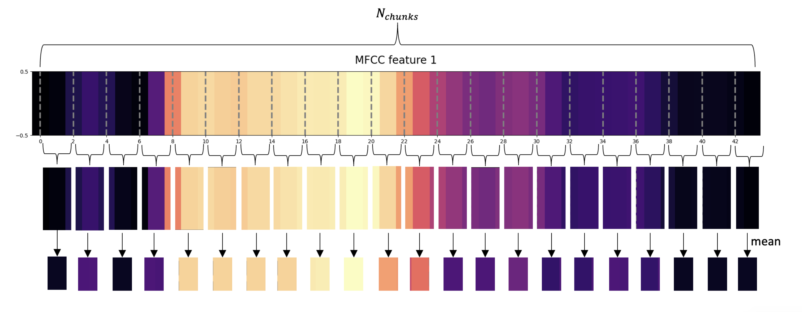

# MFCC-based Intent Recognition for Audio Signals: An Efficient Approach
Repository for the audio intent recognition project associated with the 'Data Science Lab: Process and Methods' course at Politecnico di Torino.

## Link to the paper:
https://drive.google.com/file/d/1HzErn1DaSPyEDGDx1xhItkk1JN81z1CH/view